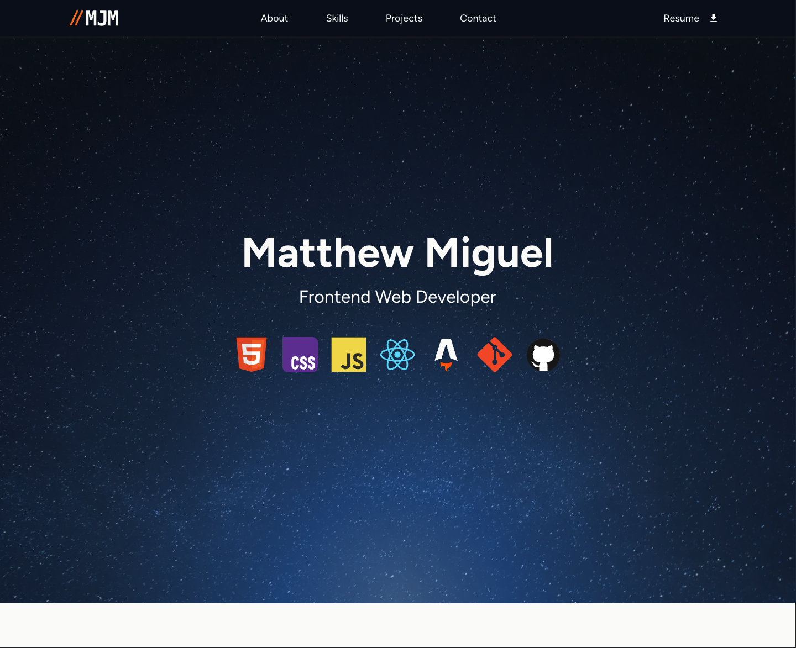

# My Portfolio Site

This is my frontend web developer portfolio featuring my skills and projects. Built using Astro.

You can visit the live site at [matthewmiguel.com](https://matthewmiguel.com)

## My Tech Stack

- **Languages**: HTML, CSS, JavaScript
- **Frameworks**: React, Astro
- **Tools**: Git, GitHub, Chrome Dev Tools, Claude AI

## Featured Projects

| Project | Tech | Live |
|---|---|---|
| Weather Now App | React, CSS, Open-Meteo API, Geolocation API | [link](https://mattjm1007.github.io/weather-app/) |
| Scoot Multi-Page Site | HTML, CSS, JavaScript | [link](https://mattjm1007.github.io/fem-scoot-challenge/) | 
| React Contact Form | React, CSS, Constraint Validation API | [link](https://mattjm1007.github.io/react-contact-form-component/) | 
| Password Generator | HTML, CSS, JavaScript | [link](https://mattjm1007.github.io/Password-Generator-App/) | 
| Frontend Quiz App | HTML, CSS, JavaScript | [link](https://mattjm1007.github.io/Frontend-Quiz-App/) | 
| FAQ Accordion | HTML, CSS | [link](https://mattjm1007.github.io/faq-accordian/) | 

## Running Locally
```bash
git clone https://github.com/mattjm1007/my-dev-portfolio.git
npm install
npm run dev
```

## Preview

