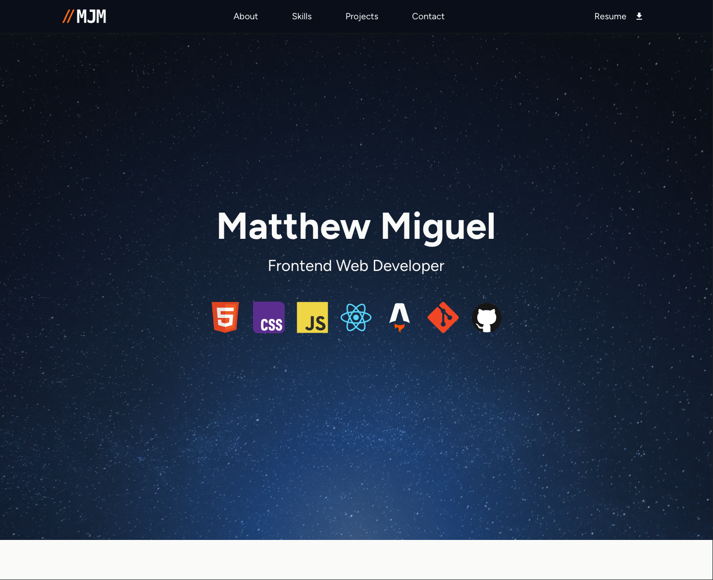

# My Portfolio Site

This is my frontend web developer portfolio featuring my skills and projects. Built using Astro.

You can visit the live site at [matthewmiguel.com](https://matthewmiguel.com)

## My Tech Stack

- **Languages**: HTML, CSS, JavaScript
- **Frameworks**: React, Astro
- **Tools**: Git, GitHub, Chrome Dev Tools

## Featured Projects

| Project               | Tech                                        | Live                                                                |
| --------------------- | ------------------------------------------- | ------------------------------------------------------------------- |
| Weather Now App       | React, CSS, Open-Meteo API, Geolocation API | [link](https://matt-miguel.github.io/weather-app/)                  |
| Scoot Multi-Page Site | HTML, CSS, JavaScript                       | [link](https://matt-miguel.github.io/fem-scoot-challenge/)          |
| React Contact Form    | React, CSS, Constraint Validation API       | [link](https://matt-miguel.github.io/react-contact-form-component/) |
| Password Generator    | HTML, CSS, JavaScript                       | [link](https://matt-miguel.github.io/Password-Generator-App/)       |
| Frontend Quiz App     | HTML, CSS, JavaScript                       | [link](https://matt-miguel.github.io/Frontend-Quiz-App/)            |
| FAQ Accordion         | HTML, CSS                                   | [link](https://matt-miguel.github.io/faq-accordian/)                |

## Running Locally

```bash
git clone https://github.com/matt-miguel/my-dev-portfolio.git
npm install
npm run dev
```

## Preview


